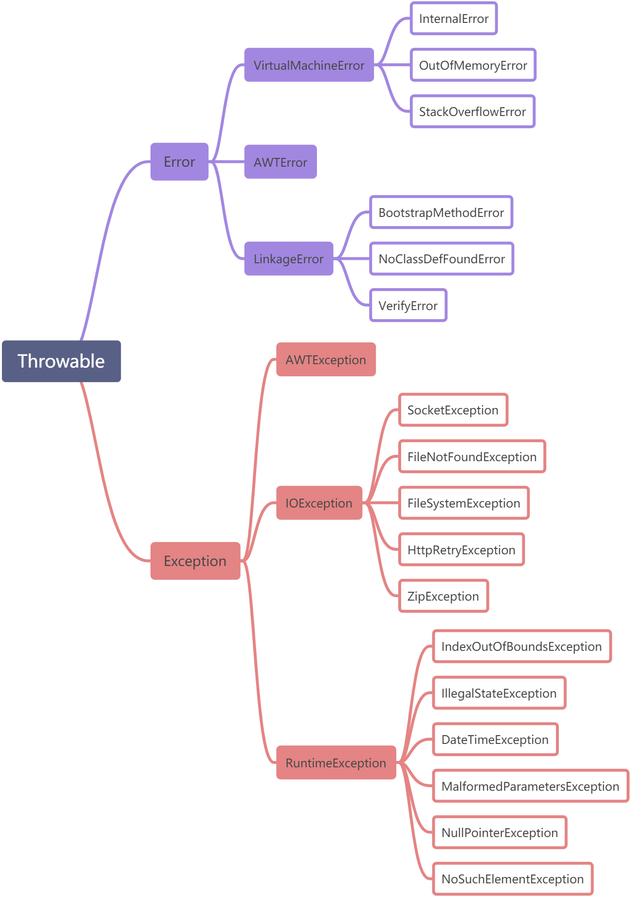

# 为什么要使用异常

> 首先我们可以明确一点就是异常的处理机制可以确保我们程序的健壮性，提高系统可用率。虽然我们不是特别喜欢看到它，
> 但是我们不能不承认它的地位，作用。

在没有异常机制的时候我们是这样处理的：通过函数的返回值来判断是否发生了异常（这个返回值通常是已经约定好了的），
调用该函数的程序负责检查并且分析返回值。虽然可以解决异常问题，但是这样做存在几个缺陷：

> 1、 容易混淆。如果约定返回值为-11111时表示出现异常，那么当程序最后的计算结果真的为-1111呢？
> 
> 2、 代码可读性差。将异常处理代码和程序代码混淆在一起将会降低代码的可读性。
> 
> 3、 由调用函数来分析异常，这要求程序员对库函数有很深的了解。

在OO中提供的异常处理机制是提供代码健壮的强有力的方式。使用异常机制它能够降低错误处理代码的复杂度，如果不使用
异常，那么就必须检查特定的错误，并在程序中的许多地方去处理它。

而如果使用异常，那就不必在方法调用处进行检查，因为异常机制将保证能够捕获这个错误，并且，只需在一个地方处理错
误，即所谓的异常处理程序中。

这种方式不仅节约代码，而且把"在正常执行过程中做什么事"的代码和"出了问题怎么办"的代码相分离。总之，与以前的错
误处理方法相比，异常机制使代码的阅读、编写和调试工作更加井井有条。（摘自《Think in java 》）。

# 异常基本定义

> 在《Think in java》中是这样定义异常的：异常情形是指阻止当前方法或者作用域继续执行的问题。在这里一定要
> 明确一点：异常代码代表某种程度的错误，尽管Java有异常处理机制，但是我们不能以“正常”的眼光来看待异常，异
> 常处理机制的原因就是告诉你：这里可能会或者已经产生了错误，您的程序出现了不正常的情况，可能会导致程序失败！
> 
> 那么什么时候才会出现异常呢？只有在你当前的环境下程序无法正常运行下去，也就是说程序已经无法来正确解决问题
> 了，这时它所就会从当前环境中跳出，并抛出异常。抛出异常后，它首先会做几件事。
> 
> 首先，它会使用new创建一个异常对象，然后在产生异常的位置终止程序，并且从当前环境中弹出对异常对象的引用，
> 这时。异常处理机制就会接管程序，并开始寻找一个恰当的地方来继续执行程序，这个恰当的地方就是异常处理程序。
> 
> 总的来说异常处理机制就是当程序发生异常时，它强制终止程序运行，记录异常信息并将这些信息反馈给我们，由我们
> 来确定是否处理异常。

# 异常体系



Throwable是java语言中所有错误和异常的超类（万物皆可抛）。它有两个子类：Error、Exception。

Java标准库内建了一些通用的异常，这些类以Throwable为顶层父类。

Throwable又派生出Error类和Exception类。

- 错误：Error类以及他的子类的实例，代表了JVM本身的错误。错误不能被程序员通过代码处理，Error很少出现。
  因此，程序员应该关注Exception为父类的分支下的各种异常类。

- 异常：Exception以及他的子类，代表程序运行时发送的各种不期望发生的事件。可以被Java异常处理机制使用，
  是异常处理的核心。

总体上我们根据Javac对异常的处理要求，将异常类分为2类。

## Checked异常

> 只有java语言提供了Checked异常，Java认为Checked异常都是可以被处理的异常，所以Java程序必须显示处理
> Checked异常。如果程序没有处理Checked异常，该程序在编译时就会发生错误无法编译。这体现了Java的设计哲
> 学：没有完善错误处理的代码根本没有机会被执行。对Checked异常处理方法有两种
> 
> 1、当前方法知道如何处理该异常，则用try...catch块来处理该异常
> 
> 2、当前方法不知道如何处理，则在定义该方法时声明抛出该异常
> 
> 我们比较熟悉的Checked异常有
> 
> Java.lang.ClassNotFoundException
> 
> Java.lang.NoSuchMetodException
> 
> java.io.IOException
  
## Runtime异常

> 所有RuntimeException类及其子类的实例被称为Runtime异常，不属于该范畴的异常则被称为CheckedException。
> 
> Runtime如除数是0和数组下标越界等，其产生频繁，处理麻烦，若显示申明或者捕获将会对程序的可读性和运行效率影
> 响很大。所以由系统自动检测并将它们交给缺省的异常处理程序。当然如果你有处理要求也可以显示捕获它们。
> 我们比较熟悉的RumtimeException类的子类有
> 
> Java.lang.IndexOutOfBoundsException
> 
> Java.lang.NullPointerException

#  初识异常

异常是在执行某个函数时引发的，而函数又是层级调用，形成调用栈的，因为，只要一个函数发生了异常，那么他的所有
的caller都会被异常影响。当这些被影响的函数以异常信息输出时，就形成的了**异常追踪栈**。 异常最先发生的地方，
叫做**异常抛出点**。

```java
public class Test {
    public static void main(String [] args ) {
        System.out.println( "----欢迎使用命令行除法计算器----" ) ;
        CMDCalculate();
    }

    public static void CMDCalculate() {
        Scanner scan = new Scanner(System.in);
        int num1 = scan.nextInt();
        int num2 = scan.nextInt();
        int result = devide(num1, num2);
        System.out.println( "result:" + result);
        scan.close();
    }

    public static int devide(int num1, int num2 ){
        return num1 / num2;
    }
}

//----欢迎使用命令行除法计算器----
//1
//0
//Exception in thread "main" java.lang.ArithmeticException: / by zero
//at com.zt.boot.Test.devide(Test.java:21)
//at com.zt.boot.Test.CMDCalculate(Test.java:15)
//at com.zt.boot.Test.main(Test.java:8)

//----欢迎使用命令行除法计算器----
//r
//Exception in thread "main" java.util.InputMismatchException
//at java.util.Scanner.throwFor(Scanner.java:864)
//at java.util.Scanner.next(Scanner.java:1485)
//at java.util.Scanner.nextInt(Scanner.java:2117)
//at java.util.Scanner.nextInt(Scanner.java:2076)
//at com.zt.boot.Test.CMDCalculate(Test.java:13)
//at com.zt.boot.Test.main(Test.java:8)
```

从上面的例子可以看出，当devide函数发生除0异常时，devide函数将抛出ArithmeticException异常，因此调用他
的CMDCalculate函数也无法正常完成，因此也发送异常，而CMDCalculate的caller——main 因为CMDCalculate抛
出异常，也发生了异常，这样一直向调用栈的栈底回溯。

这种行为叫做异常的冒泡，异常的冒泡是为了在当前发生异常的函数或者这个函数的caller中找到最近的异常处理程序。
由于这个例子中没有使用任何异常处理机制，因此异常最终由main函数抛给**JRE**，导致程序终止。

> 上面的代码不使用异常处理机制，也可以顺利编译，因为2个异常都是Runtime异常。但是下面的例子就必须使用异常处理
> 机制，因为异常是检查异常。

# 异常关键字

- try – 用于监听。将要被监听的代码(可能抛出异常的代码)放在try语句块之内，当try语句块内发生异常时，异常就
  被抛出。
  
- catch – 用于捕获异常。catch用来捕获try语句块中发生的异常。
  
- finally – finally语句块总是会被执行。它主要用于回收在try块里打开的物力资源(如数据库连接、网络连接和磁
  盘文件)。**只有finally块执行完成之后，才会回来执行try或者catch块中的return或者throw语句，如果
  finally中使用了return或者throw等终止方法的语句，则就不会跳回执行，直接停止。**
  
- throw – 用于抛出异常。
  
- throws – 用在方法签名中，用于声明该方法可能抛出的异常。

# 异常的申明(throws)

在Java中，当前执行的语句必属于某个方法，Java解释器调用main方法执行开始执行程序。若方法中存在检查异常，
如果不对其捕获，那必须在方法头中显式声明该异常，以便于告知方法调用者此方法有异常，需要进行处理。在方法中
声明一个异常，方法头中使用关键字throws，后面接上要声明的异常。若声明多个异常，则使用逗号分割。如下所示：

```java
public static void method() throws IOException, FileNotFoundException {
    //something statements
}
```

注意：若是父类的方法没有声明异常，则子类继承方法后，也不能声明异常。

通常，应该捕获那些知道如何处理的异常，将不知道如何处理的异常继续传递下去。传递异常可以在方法签名处使用
throws关键字声明可能会抛出的异常。

Throws抛出异常的规则：

- 如果是不可查异常（unchecked exception），即Error、RuntimeException或它们的子类，那么可以不使用
  throws关键字来声明要抛出的异常，编译仍能顺利通过，但在运行时会被系统抛出。
  
- 必须声明方法可抛出的任何可查异常（checked exception）。即如果一个方法可能出现受可查异常，要么用
  try-catch语句捕获，要么用throws子句声明将它抛出，否则会导致编译错误
  
- 仅当抛出了异常，该方法的调用者才必须处理或者重新抛出该异常。当方法的调用者无力处理该异常的时候，应该继续
  抛出，而不是囫囵吞枣。
  
- 调用方法必须遵循任何可查异常的处理和声明规则。若覆盖一个方法，则不能声明与覆盖方法不同的异常。声明的任何
  异常必须是被覆盖方法所声明异常的同类或子类。
  
# 异常的抛出(throw)

```java
public static double method(int value) {
    if(value == 0) {
        throw new ArithmeticException("参数不能为0"); //抛出一个运行时异常
    }
    return 5.0 / value;
}
```

大部分情况下都不需要手动抛出异常，因为Java的大部分方法要么已经处理异常，要么已声明异常。所以一般都是捕获
异常或者再往上抛。

有时我们会从 catch 中抛出一个异常，目的是为了改变异常的类型。多用于在多系统集成时，当某个子系统故障，异常
类型可能有多种，可以用统一的异常类型向外暴露，不需暴露太多内部异常细节。

```java
private static void readFile(String filePath) throws MyException {    
    try {
        // code
    } catch (IOException e) {
        MyException ex = new MyException("read file failed.");
        ex.initCause(e);
        throw ex;
    }
}
```

# 异常的自定义

习惯上，定义一个异常类应包含两个构造函数，一个无参构造函数和一个带有详细描述信息的构造函数（Throwable
的 toString 方法会打印这些详细信息，调试时很有用）, 比如上面用到的自定义MyException：

```java
public class MyException extends Exception {
    public MyException(){}
  
    public MyException(String msg){
        super(msg);
    }
    // ...
}
```

# 异常的捕获

异常捕获处理的方法通常有：

- try-catch
- try-catch-finally
- try-finally
- try-with-resource

## try-catch

在一个 try-catch 语句块中可以捕获多个异常类型，并对不同类型的异常做出不同的处理

```java
private static void readFile(String filePath) {
    try {
        // code
    } catch (FileNotFoundException e) {
        // handle FileNotFoundException
    } catch (IOException e){
        // handle IOException
    }
}
```

同一个 catch 也可以捕获多种类型异常，用 | 隔开

```java
private static void readFile(String filePath) {
    try {
        // code
    } catch (FileNotFoundException | UnknownHostException e) {
        // handle FileNotFoundException or UnknownHostException
    } catch (IOException e){
        // handle IOException
    }
}
```

## try-catch-finally

- 常规语法

```java
try {                        
    //执行程序代码，可能会出现异常                 
} catch(Exception e) {   
    //捕获异常并处理   
} finally {
    //必执行的代码
}
```

- 执行的顺序

  - 当try没有捕获到异常时：try语句块中的语句逐一被执行，程序将跳过catch语句块，执行finally语句块和其
    后的语句；
    
  - 当try捕获到异常，catch语句块里没有处理此异常的情况：当try语句块里的某条语句出现异常时，而没有处理此
    异常的catch语句块时，此异常将会抛给JVM处理，finally语句块里的语句还是会被执行，但finally语句块后的
    语句不会被执行；
    
  - 当try捕获到异常，catch语句块里有处理此异常的情况：在try语句块中是按照顺序来执行的，当执行到某一条语
    句出现异常时，程序将跳到catch语句块，并与catch语句块逐一匹配，找到与之对应的处理程序，其他的catch语
    句块将不会被执行，而try语句块中，出现异常之后的语句也不会被执行，catch语句块执行完后，执行finally语
    句块里的语句，最后执行finally语句块后的语句；
    


- 一个完整的例子

```java
public class MyException extends Exception {
  public MyException(){ }
  public MyException(String msg){
    super(msg);
  }
}

public class Test {
  public static void main(String[] args) {
    try {
      Test.readFile("abc.txt");
    } catch (MyException myException) {
      myException.printStackTrace();
    }
  }

  private static void readFile(String filePath) throws MyException {
    File file = new File(filePath);
    String result;
    BufferedReader reader = null;
    try {
      reader = new BufferedReader(new FileReader(file));
      while((result = reader.readLine())!=null) {
        System.out.println(result);
      }
    } catch (IOException e) {
      System.out.println("readFile method catch block.");
      MyException ex = new MyException("read file failed.");
      ex.initCause(e);
      throw ex;
    } finally {
      System.out.println("readFile method finally block.");
      if (null != reader) {
        try {
          reader.close();
        } catch (IOException e) {
          e.printStackTrace();
        }
      }
    }
  }
}

//readFile method catch block.
//    readFile method finally block.
//com.zt.boot.MyException: read file failed.
//    at com.zt.boot.Test.readFile(Test.java:28)
//    at com.zt.boot.Test.main(Test.java:11)
//Caused by: java.io.FileNotFoundException: abc.txt (No such file or directory)
//    at java.io.FileInputStream.open0(Native Method)
//    at java.io.FileInputStream.open(FileInputStream.java:195)
//    at java.io.FileInputStream.<init>(FileInputStream.java:138)
//    at java.io.FileReader.<init>(FileReader.java:72)
//    at com.zt.boot.Test.readFile(Test.java:22)
//    ... 1 more
```

## try-finally

try块中引起异常，异常代码之后的语句不再执行，直接执行finally语句。try块没有引发异常，则执行完try块就执
行finally语句。

try-finally可用在不需要捕获异常的代码，可以保证资源在使用后被关闭。例如IO流中执行完相应操作后，关闭相应
资源；使用Lock对象保证线程同步，通过finally可以保证锁会被释放；数据库连接代码时，关闭连接操作等等。

```java
//以Lock加锁为例，演示try-finally
ReentrantLock lock = new ReentrantLock();
try {
    //需要加锁的代码
} finally {
    lock.unlock(); //保证锁一定被释放
}
```

finally遇见如下情况不会执行

- 在前面的代码中用了System.exit()退出程序
- finally语句块中发生了异常
- 程序所在的线程死亡
- 关闭CPU

## try-with-resource

> try-with-resource是Java 7中引入的，很容易被忽略。

上面例子中，finally 中的 close 方法也可能抛出 IOException, 从而覆盖了原始异常。JAVA 7 提供了更优雅
的方式来实现资源的自动释放，自动释放的资源需要是实现了 AutoCloseable 接口的类。

- 代码实现

```java
private static void tryWithResourceTest(){
    try (Scanner scanner = new Scanner(new FileInputStream("c:/abc"),"UTF-8")){
        // code
    } catch (IOException e){
        // handle exception
    }
}
```

- 看下Scanner

```java
public interface Closeable extends AutoCloseable {
  public void close() throws IOException;
}

public final class Scanner implements Iterator<String>, Closeable {
  // ...
}
```

try 代码块退出时，会自动调用 scanner.close 方法，和把 scanner.close 方法放在 finally 代码块中不同
的是，若 scanner.close 抛出异常，则会被抑制，抛出的仍然为原始异常。被抑制的异常会由 addSusppressed 
方法添加到原来的异常，如果想要获取被抑制的异常列表，可以调用 getSuppressed 方法来获取。

# 异常基础总结

- try、catch和finally都不能单独使用，只能是try-catch、try-finally或者try-catch-finally。

- try语句块监控代码，出现异常就停止执行下面的代码，然后将异常移交给catch语句块来处理。
  
- finally语句块中的代码一定会被执行，常用于回收资源 。
  
- throws：声明一个异常，告知方法调用者。
  
- throw：抛出一个异常，至于该异常被捕获还是继续抛出都与它无关。

Java编程思想一书中，对异常的总结。 

- 在恰当的级别处理问题。（在知道该如何处理的情况下了捕获异常。）
  
- 解决问题并且重新调用产生异常的方法。
  
- 进行少许修补，然后绕过异常发生的地方继续执行。
  
- 用别的数据进行计算，以代替方法预计会返回的值。
  
- 把当前运行环境下能做的事尽量做完，然后把相同的异常重抛到更高层。
  
- 把当前运行环境下能做的事尽量做完，然后把不同的异常抛到更高层。
  
- 终止程序。
  
- 进行简化（如果你的异常模式使问题变得太复杂，那么用起来会非常痛苦）。
  
- 让类库和程序更安全。

# 常用的异常

在Java中提供了一些异常用来描述经常发生的错误，对于这些异常，有的需要程序员进行捕获处理或声明抛出，
有的是由Java虚拟机自动进行捕获处理。

Java中常见的异常类: 

- RuntimeException
    - java.lang.ArrayIndexOutOfBoundsException 数组索引越界异常。当对数组的索引值为负数或大于等于数组大小时抛出。
    - java.lang.ArithmeticException 算术条件异常。譬如：整数除零等。
    - java.lang.NullPointerException 空指针异常。当应用试图在要求使用对象的地方使用了null时，抛出该异常。譬如：调用null对象的实例方法、访问null对象的属性、计算null对象的长度、使用throw语句抛出null等等
    - java.lang.ClassNotFoundException 找不到类异常。当应用试图根据字符串形式的类名构造类，而在遍历CLASSPAH之后找不到对应名称的class文件时，抛出该异常。
    - java.lang.NegativeArraySizeException  数组长度为负异常
    - java.lang.ArrayStoreException 数组中包含不兼容的值抛出的异常
    - java.lang.SecurityException 安全性异常
    - java.lang.IllegalArgumentException 非法参数异常 
    - IOException
      
- IOException：操作输入流和输出流时可能出现的异常。
    - EOFException 文件已结束异常
    - FileNotFoundException 文件未找到异常
      
- 其他
    - ClassCastException 类型转换异常类
    - ArrayStoreException  数组中包含不兼容的值抛出的异常
    - SQLException   操作数据库异常类
    - NoSuchFieldException   字段未找到异常
    - NoSuchMethodException   方法未找到抛出的异常
    - NumberFormatException    字符串转换为数字抛出的异常
    - StringIndexOutOfBoundsException 字符串索引超出范围抛出的异常
    - IllegalAccessException  不允许访问某类异常
    - InstantiationException  当应用程序试图使用Class类中的newInstance()方法创建一个类的实例，而指定的类对象无法被实例化时，抛出该异常
  
# 异常实践