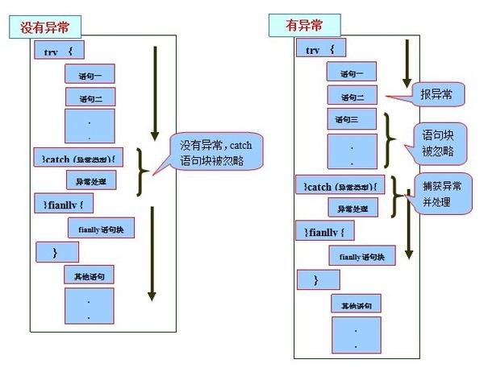

# 为什么要使用异常

> 首先我们可以明确一点就是异常的处理机制可以确保我们程序的健壮性，提高系统可用率。虽然我们不是特别喜欢看到它，
> 但是我们不能不承认它的地位，作用。

在没有异常机制的时候我们是这样处理的：通过函数的返回值来判断是否发生了异常（这个返回值通常是已经约定好了的），
调用该函数的程序负责检查并且分析返回值。虽然可以解决异常问题，但是这样做存在几个缺陷：

> 1、 容易混淆。如果约定返回值为-11111时表示出现异常，那么当程序最后的计算结果真的为-1111呢？
> 
> 2、 代码可读性差。将异常处理代码和程序代码混淆在一起将会降低代码的可读性。
> 
> 3、 由调用函数来分析异常，这要求程序员对库函数有很深的了解。

在OO中提供的异常处理机制是提供代码健壮的强有力的方式。使用异常机制它能够降低错误处理代码的复杂度，如果不使用
异常，那么就必须检查特定的错误，并在程序中的许多地方去处理它。

而如果使用异常，那就不必在方法调用处进行检查，因为异常机制将保证能够捕获这个错误，并且，只需在一个地方处理错
误，即所谓的异常处理程序中。

这种方式不仅节约代码，而且把"在正常执行过程中做什么事"的代码和"出了问题怎么办"的代码相分离。总之，与以前的错
误处理方法相比，异常机制使代码的阅读、编写和调试工作更加井井有条。（摘自《Think in java 》）。

# 异常基本定义

> 在《Think in java》中是这样定义异常的：异常情形是指阻止当前方法或者作用域继续执行的问题。在这里一定要
> 明确一点：异常代码代表某种程度的错误，尽管Java有异常处理机制，但是我们不能以“正常”的眼光来看待异常，异
> 常处理机制的原因就是告诉你：这里可能会或者已经产生了错误，您的程序出现了不正常的情况，可能会导致程序失败！
> 
> 那么什么时候才会出现异常呢？只有在你当前的环境下程序无法正常运行下去，也就是说程序已经无法来正确解决问题
> 了，这时它所就会从当前环境中跳出，并抛出异常。抛出异常后，它首先会做几件事。
> 
> 首先，它会使用new创建一个异常对象，然后在产生异常的位置终止程序，并且从当前环境中弹出对异常对象的引用，
> 这时。异常处理机制就会接管程序，并开始寻找一个恰当的地方来继续执行程序，这个恰当的地方就是异常处理程序。
> 
> 总的来说异常处理机制就是当程序发生异常时，它强制终止程序运行，记录异常信息并将这些信息反馈给我们，由我们
> 来确定是否处理异常。

# 异常体系


Throwable是java语言中所有错误和异常的超类（万物皆可抛）。它有两个子类：Error、Exception。

Java标准库内建了一些通用的异常，这些类以Throwable为顶层父类。

Throwable又派生出Error类和Exception类。

- 错误：Error类以及他的子类的实例，代表了JVM本身的错误。错误不能被程序员通过代码处理，Error很少出现。
  因此，程序员应该关注Exception为父类的分支下的各种异常类。

- 异常：Exception以及他的子类，代表程序运行时发送的各种不期望发生的事件。可以被Java异常处理机制使用，
  是异常处理的核心。

总体上我们根据Javac对异常的处理要求，将异常类分为2类。

## Checked异常

> 只有java语言提供了Checked异常，Java认为Checked异常都是可以被处理的异常，所以Java程序必须显示处理
> Checked异常。如果程序没有处理Checked异常，该程序在编译时就会发生错误无法编译。这体现了Java的设计哲
> 学：没有完善错误处理的代码根本没有机会被执行。对Checked异常处理方法有两种
> 
> 1、当前方法知道如何处理该异常，则用try...catch块来处理该异常
> 
> 2、当前方法不知道如何处理，则在定义该方法时声明抛出该异常
> 
> 我们比较熟悉的Checked异常有
> 
> Java.lang.ClassNotFoundException
> 
> Java.lang.NoSuchMetodException
> 
> java.io.IOException
  
## Runtime异常

> 所有RuntimeException类及其子类的实例被称为Runtime异常，不属于该范畴的异常则被称为CheckedException。
> 
> Runtime如除数是0和数组下标越界等，其产生频繁，处理麻烦，若显示申明或者捕获将会对程序的可读性和运行效率影
> 响很大。所以由系统自动检测并将它们交给缺省的异常处理程序。当然如果你有处理要求也可以显示捕获它们。
> 我们比较熟悉的RumtimeException类的子类有
> 
> Java.lang.IndexOutOfBoundsException
> 
> Java.lang.NullPointerException

#  初识异常

异常是在执行某个函数时引发的，而函数又是层级调用，形成调用栈的，因为，只要一个函数发生了异常，那么他的所有
的caller都会被异常影响。当这些被影响的函数以异常信息输出时，就形成的了**异常追踪栈**。 异常最先发生的地方，
叫做**异常抛出点**。

```java
public class Test {
    public static void main(String [] args ) {
        System.out.println( "----欢迎使用命令行除法计算器----" ) ;
        CMDCalculate();
    }

    public static void CMDCalculate() {
        Scanner scan = new Scanner(System.in);
        int num1 = scan.nextInt();
        int num2 = scan.nextInt();
        int result = devide(num1, num2);
        System.out.println( "result:" + result);
        scan.close();
    }

    public static int devide(int num1, int num2 ){
        return num1 / num2;
    }
}

//----欢迎使用命令行除法计算器----
//1
//0
//Exception in thread "main" java.lang.ArithmeticException: / by zero
//at com.zt.boot.Test.devide(Test.java:21)
//at com.zt.boot.Test.CMDCalculate(Test.java:15)
//at com.zt.boot.Test.main(Test.java:8)

//----欢迎使用命令行除法计算器----
//r
//Exception in thread "main" java.util.InputMismatchException
//at java.util.Scanner.throwFor(Scanner.java:864)
//at java.util.Scanner.next(Scanner.java:1485)
//at java.util.Scanner.nextInt(Scanner.java:2117)
//at java.util.Scanner.nextInt(Scanner.java:2076)
//at com.zt.boot.Test.CMDCalculate(Test.java:13)
//at com.zt.boot.Test.main(Test.java:8)
```

从上面的例子可以看出，当devide函数发生除0异常时，devide函数将抛出ArithmeticException异常，因此调用他
的CMDCalculate函数也无法正常完成，因此也发送异常，而CMDCalculate的caller——main 因为CMDCalculate抛
出异常，也发生了异常，这样一直向调用栈的栈底回溯。

这种行为叫做异常的冒泡，异常的冒泡是为了在当前发生异常的函数或者这个函数的caller中找到最近的异常处理程序。
由于这个例子中没有使用任何异常处理机制，因此异常最终由main函数抛给**JRE**，导致程序终止。

> 上面的代码不使用异常处理机制，也可以顺利编译，因为2个异常都是Runtime异常。但是下面的例子就必须使用异常处理
> 机制，因为异常是检查异常。

# 异常关键字

- try – 用于监听。将要被监听的代码(可能抛出异常的代码)放在try语句块之内，当try语句块内发生异常时，异常就
  被抛出。
  
- catch – 用于捕获异常。catch用来捕获try语句块中发生的异常。
  
- finally – finally语句块总是会被执行。它主要用于回收在try块里打开的物力资源(如数据库连接、网络连接和磁
  盘文件)。**只有finally块执行完成之后，才会回来执行try或者catch块中的return或者throw语句，如果
  finally中使用了return或者throw等终止方法的语句，则就不会跳回执行，直接停止。**
  
- throw – 用于抛出异常。
  
- throws – 用在方法签名中，用于声明该方法可能抛出的异常。

# 异常的申明(throws)

在Java中，当前执行的语句必属于某个方法，Java解释器调用main方法执行开始执行程序。若方法中存在检查异常，
如果不对其捕获，那必须在方法头中显式声明该异常，以便于告知方法调用者此方法有异常，需要进行处理。在方法中
声明一个异常，方法头中使用关键字throws，后面接上要声明的异常。若声明多个异常，则使用逗号分割。如下所示：

```java
public static void method() throws IOException, FileNotFoundException {
    //something statements
}
```

注意：若是父类的方法没有声明异常，则子类继承方法后，也不能声明异常。

通常，应该捕获那些知道如何处理的异常，将不知道如何处理的异常继续传递下去。传递异常可以在方法签名处使用
throws关键字声明可能会抛出的异常。

Throws抛出异常的规则：

- 如果是不可查异常（unchecked exception），即Error、RuntimeException或它们的子类，那么可以不使用
  throws关键字来声明要抛出的异常，编译仍能顺利通过，但在运行时会被系统抛出。
  
- 必须声明方法可抛出的任何可查异常（checked exception）。即如果一个方法可能出现受可查异常，要么用
  try-catch语句捕获，要么用throws子句声明将它抛出，否则会导致编译错误
  
- 仅当抛出了异常，该方法的调用者才必须处理或者重新抛出该异常。当方法的调用者无力处理该异常的时候，应该继续
  抛出，而不是囫囵吞枣。
  
- 调用方法必须遵循任何可查异常的处理和声明规则。若覆盖一个方法，则不能声明与覆盖方法不同的异常。声明的任何
  异常必须是被覆盖方法所声明异常的同类或子类。
  
# 异常的抛出(throw)

```java
public static double method(int value) {
    if(value == 0) {
        throw new ArithmeticException("参数不能为0"); //抛出一个运行时异常
    }
    return 5.0 / value;
}
```

大部分情况下都不需要手动抛出异常，因为Java的大部分方法要么已经处理异常，要么已声明异常。所以一般都是捕获
异常或者再往上抛。

有时我们会从 catch 中抛出一个异常，目的是为了改变异常的类型。多用于在多系统集成时，当某个子系统故障，异常
类型可能有多种，可以用统一的异常类型向外暴露，不需暴露太多内部异常细节。

```java
private static void readFile(String filePath) throws MyException {    
    try {
        // code
    } catch (IOException e) {
        MyException ex = new MyException("read file failed.");
        ex.initCause(e);
        throw ex;
    }
}
```

# 异常的自定义

习惯上，定义一个异常类应包含两个构造函数，一个无参构造函数和一个带有详细描述信息的构造函数（Throwable
的 toString 方法会打印这些详细信息，调试时很有用）, 比如上面用到的自定义MyException：

```java
public class MyException extends Exception {
    public MyException(){}
  
    public MyException(String msg){
        super(msg);
    }
    // ...
}
```

# 异常的捕获

异常捕获处理的方法通常有：

- try-catch
- try-catch-finally
- try-finally
- try-with-resource

## try-catch

在一个 try-catch 语句块中可以捕获多个异常类型，并对不同类型的异常做出不同的处理

```java
private static void readFile(String filePath) {
    try {
        // code
    } catch (FileNotFoundException e) {
        // handle FileNotFoundException
    } catch (IOException e){
        // handle IOException
    }
}
```

同一个 catch 也可以捕获多种类型异常，用 | 隔开

```java
private static void readFile(String filePath) {
    try {
        // code
    } catch (FileNotFoundException | UnknownHostException e) {
        // handle FileNotFoundException or UnknownHostException
    } catch (IOException e){
        // handle IOException
    }
}
```

## try-catch-finally

- 常规语法

```java
try {                        
    //执行程序代码，可能会出现异常                 
} catch(Exception e) {   
    //捕获异常并处理   
} finally {
    //必执行的代码
}
```

- 执行的顺序

  - 当try没有捕获到异常时：try语句块中的语句逐一被执行，程序将跳过catch语句块，执行finally语句块和其
    后的语句；
    
  - 当try捕获到异常，catch语句块里没有处理此异常的情况：当try语句块里的某条语句出现异常时，而没有处理此
    异常的catch语句块时，此异常将会抛给JVM处理，finally语句块里的语句还是会被执行，但finally语句块后的
    语句不会被执行；
    
  - 当try捕获到异常，catch语句块里有处理此异常的情况：在try语句块中是按照顺序来执行的，当执行到某一条语
    句出现异常时，程序将跳到catch语句块，并与catch语句块逐一匹配，找到与之对应的处理程序，其他的catch语
    句块将不会被执行，而try语句块中，出现异常之后的语句也不会被执行，catch语句块执行完后，执行finally语
    句块里的语句，最后执行finally语句块后的语句；
    


- 一个完整的例子

```java
public class MyException extends Exception {
  public MyException(){ }
  public MyException(String msg){
    super(msg);
  }
}

public class Test {
  public static void main(String[] args) {
    try {
      Test.readFile("abc.txt");
    } catch (MyException myException) {
      myException.printStackTrace();
    }
  }

  private static void readFile(String filePath) throws MyException {
    File file = new File(filePath);
    String result;
    BufferedReader reader = null;
    try {
      reader = new BufferedReader(new FileReader(file));
      while((result = reader.readLine())!=null) {
        System.out.println(result);
      }
    } catch (IOException e) {
      System.out.println("readFile method catch block.");
      MyException ex = new MyException("read file failed.");
      ex.initCause(e);
      throw ex;
    } finally {
      System.out.println("readFile method finally block.");
      if (null != reader) {
        try {
          reader.close();
        } catch (IOException e) {
          e.printStackTrace();
        }
      }
    }
  }
}

//readFile method catch block.
//    readFile method finally block.
//com.zt.boot.MyException: read file failed.
//    at com.zt.boot.Test.readFile(Test.java:28)
//    at com.zt.boot.Test.main(Test.java:11)
//Caused by: java.io.FileNotFoundException: abc.txt (No such file or directory)
//    at java.io.FileInputStream.open0(Native Method)
//    at java.io.FileInputStream.open(FileInputStream.java:195)
//    at java.io.FileInputStream.<init>(FileInputStream.java:138)
//    at java.io.FileReader.<init>(FileReader.java:72)
//    at com.zt.boot.Test.readFile(Test.java:22)
//    ... 1 more
```

## try-finally

try块中引起异常，异常代码之后的语句不再执行，直接执行finally语句。try块没有引发异常，则执行完try块就执
行finally语句。

try-finally可用在不需要捕获异常的代码，可以保证资源在使用后被关闭。例如IO流中执行完相应操作后，关闭相应
资源；使用Lock对象保证线程同步，通过finally可以保证锁会被释放；数据库连接代码时，关闭连接操作等等。

```java
//以Lock加锁为例，演示try-finally
ReentrantLock lock = new ReentrantLock();
try {
    //需要加锁的代码
} finally {
    lock.unlock(); //保证锁一定被释放
}
```

finally遇见如下情况不会执行

- 在前面的代码中用了System.exit()退出程序
- finally语句块中发生了异常
- 程序所在的线程死亡
- 关闭CPU

## try-with-resource

> try-with-resource是Java 7中引入的，很容易被忽略。

上面例子中，finally 中的 close 方法也可能抛出 IOException, 从而覆盖了原始异常。JAVA 7 提供了更优雅
的方式来实现资源的自动释放，自动释放的资源需要是实现了 AutoCloseable 接口的类。

- 代码实现

```java
private static void tryWithResourceTest(){
    try (Scanner scanner = new Scanner(new FileInputStream("c:/abc"),"UTF-8")){
        // code
    } catch (IOException e){
        // handle exception
    }
}
```

- 看下Scanner

```java
public interface Closeable extends AutoCloseable {
  public void close() throws IOException;
}

public final class Scanner implements Iterator<String>, Closeable {
  // ...
}
```

try 代码块退出时，会自动调用 scanner.close 方法，和把 scanner.close 方法放在 finally 代码块中不同
的是，若 scanner.close 抛出异常，则会被抑制，抛出的仍然为原始异常。被抑制的异常会由 addSusppressed 
方法添加到原来的异常，如果想要获取被抑制的异常列表，可以调用 getSuppressed 方法来获取。

# 异常基础总结

- try、catch和finally都不能单独使用，只能是try-catch、try-finally或者try-catch-finally。

- try语句块监控代码，出现异常就停止执行下面的代码，然后将异常移交给catch语句块来处理。
  
- finally语句块中的代码一定会被执行，常用于回收资源 。
  
- throws：声明一个异常，告知方法调用者。
  
- throw：抛出一个异常，至于该异常被捕获还是继续抛出都与它无关。

Java编程思想一书中，对异常的总结。 

- 在恰当的级别处理问题。（在知道该如何处理的情况下了捕获异常。）
  
- 解决问题并且重新调用产生异常的方法。
  
- 进行少许修补，然后绕过异常发生的地方继续执行。
  
- 用别的数据进行计算，以代替方法预计会返回的值。
  
- 把当前运行环境下能做的事尽量做完，然后把相同的异常重抛到更高层。
  
- 把当前运行环境下能做的事尽量做完，然后把不同的异常抛到更高层。
  
- 终止程序。
  
- 进行简化（如果你的异常模式使问题变得太复杂，那么用起来会非常痛苦）。
  
- 让类库和程序更安全。

# 常用的异常

在Java中提供了一些异常用来描述经常发生的错误，对于这些异常，有的需要程序员进行捕获处理或声明抛出，
有的是由Java虚拟机自动进行捕获处理。

Java中常见的异常类: 

- RuntimeException
    - java.lang.ArrayIndexOutOfBoundsException 数组索引越界异常。当对数组的索引值为负数或大于等于数组大小时抛出。
    - java.lang.ArithmeticException 算术条件异常。譬如：整数除零等。
    - java.lang.NullPointerException 空指针异常。当应用试图在要求使用对象的地方使用了null时，抛出该异常。譬如：调用null对象的实例方法、访问null对象的属性、计算null对象的长度、使用throw语句抛出null等等
    - java.lang.ClassNotFoundException 找不到类异常。当应用试图根据字符串形式的类名构造类，而在遍历CLASSPAH之后找不到对应名称的class文件时，抛出该异常。
    - java.lang.NegativeArraySizeException  数组长度为负异常
    - java.lang.ArrayStoreException 数组中包含不兼容的值抛出的异常
    - java.lang.SecurityException 安全性异常
    - java.lang.IllegalArgumentException 非法参数异常 
    - IOException
      
- IOException：操作输入流和输出流时可能出现的异常。
    - EOFException 文件已结束异常
    - FileNotFoundException 文件未找到异常
      
- 其他
    - ClassCastException 类型转换异常类
    - ArrayStoreException  数组中包含不兼容的值抛出的异常
    - SQLException   操作数据库异常类
    - NoSuchFieldException   字段未找到异常
    - NoSuchMethodException   方法未找到抛出的异常
    - NumberFormatException    字符串转换为数字抛出的异常
    - StringIndexOutOfBoundsException 字符串索引超出范围抛出的异常
    - IllegalAccessException  不允许访问某类异常
    - InstantiationException  当应用程序试图使用Class类中的newInstance()方法创建一个类的实例，而指定的类对象无法被实例化时，抛出该异常
  
# 异常实践

当你抛出或捕获异常的时候，有很多不同的情况需要考虑，而且大部分事情都是为了改善代码的可读性或者 API 的可用性。 

异常不仅仅是一个错误控制机制，也是一个通信媒介。因此，为了和同事更好的合作，一个团队必须要制定出一个最佳实践和
规则，只有这样，团队成员才能理解这些通用概念，同时在工作中使用它。 

这里给出几个被很多团队使用的异常处理最佳实践。

# 只针对不正常的情况才使用异常

> 异常只应该被用于不正常的条件，它们永远不应该被用于正常的控制流。《阿里手册》中：【强制】Java 类库中定义的可以
> 通过预检查方式规避的RuntimeException异常不应该通过catch 的方式来处理，比如：NullPointerException，
> IndexOutOfBoundsException等等。

比如，在解析字符串形式的数字时，可能存在数字格式错误，不得通过catch Exception来实现

- 代码1

```java
if (obj != null) {
  //...
}
```

- 代码2

```java
try { 
  obj.method(); 
} catch (NullPointerException e) {
  //...
}
```

主要原因有三点： 

- 异常机制的设计初衷是用于不正常的情况，所以很少会有JVM实现试图对它们的性能进行优化。
  所以，创建、抛出和捕获异常的开销是很昂贵的。
  
- 把代码放在try-catch中返回阻止了JVM实现本来可能要执行的某些特定的优化。
  
- 对数组进行遍历的标准模式并不会导致冗余的检查，有些现代的JVM实现会将它们优化掉。

# 在 finally 块中清理资源或者使用 try-with-resource 语句

当使用类似InputStream这种需要使用后关闭的资源时，一个常见的错误就是在try块的最后关闭资源。

- 错误示例

```java
public void doNotCloseResourceInTry() {
    FileInputStream inputStream = null;
    try {
        File file = new File("./tmp.txt");
        inputStream = new FileInputStream(file);
        // use the inputStream to read a file
        // do NOT do this
        inputStream.close();
    } catch (FileNotFoundException e) {
        log.error(e);
    } catch (IOException e) {
        log.error(e);
    }
}
```

问题就是，只有没有异常抛出的时候，这段代码才可以正常工作。try 代码块内代码会正常执行，
并且资源可以正常关闭。但是，使用 try 代码块是有原因的，一般调用一个或多个可能抛出异常
的方法，而且，你自己也可能会抛出一个异常，这意味着代码可能不会执行到 try 代码块的最后
部分。结果就是，你并没有关闭资源。

所以，你应该把清理工作的代码放到 finally 里去，或者使用 try-with-resource 特性。

## 方法一：使用 finally 代码块

与前面几行 try 代码块不同，finally 代码块总是会被执行。不管 try 代码块成功执行之后还
是你在 catch 代码块中处理完异常后都会执行。因此，你可以确保你清理了所有打开的资源。

```java
public void closeResourceInFinally() {
    FileInputStream inputStream = null;
    try {
        File file = new File("./tmp.txt");
        inputStream = new FileInputStream(file);
        // use the inputStream to read a file
    } catch (FileNotFoundException e) {
        log.error(e);
    } finally {
        if (inputStream != null) {
            try {
                inputStream.close();
            } catch (IOException e) {
                log.error(e);
            }
        }
    }
}
```

## 方法二：Java 7 的 try-with-resource 语法

如果你的资源实现了 AutoCloseable 接口，你可以使用这个语法。大多数的 Java 标准资源都
继承了这个接口。当你在 try 子句中打开资源，资源会在 try 代码块执行后或异常处理后自动关闭。

```java
public void automaticallyCloseResource() {
    File file = new File("./tmp.txt");
    try (FileInputStream inputStream = new FileInputStream(file);) {
        // use the inputStream to read a file
    } catch (FileNotFoundException e) {
        log.error(e);
    } catch (IOException e) {
        log.error(e);
    }
}
```

## 尽量使用标准的异常

> 代码重用是值得提倡的，这是一条通用规则，异常也不例外。

重用现有的异常有几个好处： 

- 它使得你的API更加易于学习和使用，因为它与程序员原来已经熟悉的习惯用法是一致的。
  
- 对于用到这些API的程序而言，它们的可读性更好，因为它们不会充斥着程序员不熟悉的异常。
  
- 异常类越少，意味着内存占用越小，并且转载这些类的时间开销也越小。

Java标准异常中有几个是经常被使用的异常。如下表格：

| 异常                             | 使用场合                             |
| ------------------------------- | ----------------------------------- |
| IllegalArgumentException        | 参数的值不合适                        |
| IllegalStateException           | 参数的状态不合适                      |
| NullPointerException            | 在null被禁止的情况下参数值为null        |
| IndexOutOfBoundsException       | 下标越界                             |
| ConcurrentModificationException | 在禁止并发修改的情况下，对象检测到并发修改 |
| UnsupportedOperationException   | 对象不支持客户请求的方法                |

虽然它们是Java平台库迄今为止最常被重用的异常，但是，在许可的条件下，其它的异常也可以被重用。例如，如果你要实现诸如复数
或者矩阵之类的算术对象，那么重用ArithmeticException和NumberFormatException将是非常合适的。如果一个异常满足你的
需要，则不要犹豫，使用就可以，不过你一定要确保抛出异常的条件与该异常的文档中描述的条件一致。这种重用必须建立在语义的基
础上，而不是名字的基础上。

最后，一定要清楚，选择重用哪一种异常并没有必须遵循的规则。例如，考虑纸牌对象的情形，假设有一个用于发牌操作的方法，它的
参数(handSize)是发一手牌的纸牌张数。假设调用者在这个参数中传递的值大于整副牌的剩余张数。那么这种情形既可以被解释为
IllegalArgumentException(handSize的值太大)，也可以被解释为IllegalStateException(相对客户的请求而言，纸牌对
象的纸牌太少)。

# 对异常进行文档说明

> 当在方法上声明抛出异常时，也需要进行文档说明。目的是为了给调用者提供尽可能多的信息，从而可以更好地避免或处理异常。

在 Javadoc 添加 @throws 声明，并且描述抛出异常的场景。

```java
/**
* Method description
* 
* @throws MyBusinessException - businuess exception description
*/
public void doSomething(String input) throws MyBusinessException {
   // ...
}
```

同时，在抛出MyBusinessException异常时，需要尽可能精确地描述问题和相关信息，这样无论是打印到日志中还是在监控工具中，
都能够更容易被人阅读，从而可以更好地定位具体错误信息、错误的严重程度等。

# 优先捕获最具体的异常

> 大多数 IDE 都可以帮助你实现这个最佳实践。当你尝试首先捕获较不具体的异常时，它们会报告无法访问的代码块。

但问题在于，只有匹配异常的第一个 catch 块会被执行。 因此，如果首先捕获 IllegalArgumentException ，则永远不会到达
应该处理更具体的 NumberFormatException 的 catch 块，因为它是 IllegalArgumentException 的子类。 

总是优先捕获最具体的异常类，并将不太具体的 catch 块添加到列表的末尾。 

你可以在下面的代码片段中看到这样一个 try-catch 语句的例子。第一个 catch 块处理所有 NumberFormatException 异常，
第二个处理所有非 NumberFormatException 异常的 IllegalArgumentException 异常。

# 不要捕获 Throwable 类

> Throwable 是所有异常和错误的超类。你可以在 catch 子句中使用它，但是你永远不应该这样做！

如果在 catch 子句中使用 Throwable ，它不仅会捕获所有异常，也将捕获所有的错误。JVM 抛出错误，指出不应该由应用程序处理
的严重问题。 典型的例子是 OutOfMemoryError 或者 StackOverflowError 。两者都是由应用程序控制之外的情况引起的，无法处理。 

所以，最好不要捕获 Throwable ，除非你确定自己处于一种特殊的情况下能够处理错误。

```java
public void doNotCatchThrowable() {
    try {
        // do something
    } catch (Throwable t) {
        // don't do this!
    }
}
```

# 不要忽略异常

> 很多时候，开发者很有自信不会抛出异常，因此写了一个catch块，但是没有做任何处理或者记录日志。

```java
public void doNotIgnoreExceptions() {
    try {
        // do something
    } catch (NumberFormatException e) {
        // this will never happen
    }
}
```

但现实是经常会出现无法预料的异常，或者无法确定这里的代码未来是不是会改动(删除了阻止异常抛出的代码)，而此时由于异常被捕获，使得
无法拿到足够的错误信息来定位问题。

合理的做法是至少要记录异常的信息。

```java
public void logAnException() {
    try {
        // do something
    } catch (NumberFormatException e) {
        log.error("This should never happen: " + e); // see this line
    }
}
```

# 不要记录并抛出异常

可以发现很多代码甚至类库中都会有捕获异常、记录日志并再次抛出的逻辑。如下：

```java
try {
    new Long("xyz");
} catch (NumberFormatException e) {
    log.error(e);
    throw e;
}
```

这个处理逻辑看着是合理的。但这经常会给同一个异常输出多条日志。如下：

```java
//17:44:28,945 ERROR TestExceptionHandling:65 - java.lang.NumberFormatException: For input string: "xyz"
//Exception in thread "main" java.lang.NumberFormatException: For input string: "xyz"
//at java.lang.NumberFormatException.forInputString(NumberFormatException.java:65)
//at java.lang.Long.parseLong(Long.java:589)
//at java.lang.Long.(Long.java:965)
//at com.stackify.example.TestExceptionHandling.logAndThrowException(TestExceptionHandling.java:63)
//at com.stackify.example.TestExceptionHandling.main(TestExceptionHandling.java:58)
```

如上所示，后面的日志也没有附加更有用的信息。如果想要提供更加有用的信息，那么可以将异常包装为自定义异常。

```java
public void wrapException(String input) throws MyBusinessException {
    try {
        // do something
    } catch (NumberFormatException e) {
        throw new MyBusinessException("A message that describes the error.", e);
    }
}
```

因此，仅仅当想要处理异常时才去捕获，否则只需要在方法签名中声明让调用者去处理。

# 包装异常时不要抛弃原始的异常

捕获标准异常并包装为自定义异常是一个很常见的做法。这样可以添加更为具体的异常信息并能够做针对的异常处理。在你这样做时，请确保
将原始异常设置为原因（注：参考下方代码 NumberFormatException e 中的原始异常 e ）。Exception 类提供了特殊的构造函数方
法，它接受一个 Throwable 作为参数。否则，你将会丢失堆栈跟踪和原始异常的消息，这将会使分析导致异常的异常事件变得困难。

```java
public void wrapException(String input) throws MyBusinessException {
    try {
        // do something
    } catch (NumberFormatException e) {
        throw new MyBusinessException("A message that describes the error.", e);
    }
}
```

# 不要使用异常控制程序的流程

不应该使用异常控制应用的执行流程，例如，本应该使用if语句进行条件判断的情况下，你却使用异常处理，这是非常不好的习惯，会严重
影响应用的性能。

# 不要在finally块中使用return

try块中的return语句执行成功后，**并不马上返回**，而是继续执行finally块中的语句，如果此处存在return语句，则在此直接返回，
无情丢弃掉try块中的返回点。

```java
private int x = 0;
public int checkReturn() {
    try {
        // x等于1，此处不返回
        return ++x;
    } finally {
        // 返回的结果是2
        return ++x;
    }
}
```

# 异常方法比较

```java
public class TestInfo {
    private static String str =null;
    public static void main(String[] args) {
        try {
            if(str.equals("name")){
                System.out.println("test exception");
            }
        } catch (Exception e) {
            System.out.println(e.toString());
            System.out.println(e.getMessage());
        }
    }
}
/**
 * 输出结果：
 * java.lang.NullPointerException
 * null
 */
```

```java
public class TestInfo {
    private static int m = 0;
    public static void main(String[] args) {
        try {
            m = 899/0;
        } catch (Exception e) {
            System.out.println(e.toString());
            System.out.println(e.getMessage());
        }
    }
}
/**
 * 输出结果：
 * java.lang.ArithmeticException: / by zero
 * / by zero
 */
```

由此可以看出，e.toString()获取的信息包括**异常类型和异常详细消息**，而e.getMessage()只是获取了**异常的详细消息字符串**。

e.printStackTrace()会打出详细异常，异常名称，出错位置，便于调试用，一般一个异常至少几十行

# REF

1、https://www.pdai.tech/md/java/basic/java-basic-x-exception.html#%E6%B7%B1%E5%85%A5%E7%90%86%E8%A7%A3%E5%BC%82%E5%B8%B8

2、https://www.cnblogs.com/yangyi9343/p/5900771.html